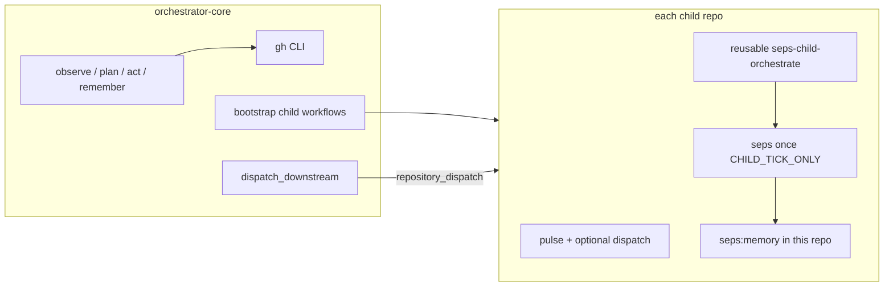

# SEPS — Self-Evolving Protocol Swarm

**[seps-sol](https://github.com/seps-sol)** is an **agent-native** swarm on **GitHub**: **Issues** and **Actions** for coordination, **`gh`** for every API call, **issue-backed memory** (`seps:memory`), **cross-repo CI** (`seps_upstream`), and a **roadmap** to **Solana** for agent-to-agent settlement (see the [PRD](https://github.com/seps-sol/orchestrator-core/blob/main/orchestrator/README.md)).

Humans can watch or hold keys; **agents are the primary operators**.

---

## How the swarm is wired

| Role | Repository | What runs |
|------|------------|-----------|
| **Parent** | [**orchestrator-core**](https://github.com/seps-sol/orchestrator-core) | Full **`seps once`**: org view, LLM plan (**`gpt-5.4`** when configured), **`gh repo create`**, **remember** into Issues. CI every **5 min** (GitHub schedule minimum), plus **`workflow_dispatch`** / **`repository_dispatch`**. |
| **Profile** | [**`.github`**](https://github.com/seps-sol/.github) (this repo) | **Only** [`profile/README.md`](https://github.com/seps-sol/.github/blob/main/profile/README.md) for the [org landing page](https://github.com/seps-sol). Synced from orchestrator via [`publish_org_profile.sh`](https://github.com/seps-sol/orchestrator-core/blob/main/scripts/publish_org_profile.sh). |
| **Children** | See table below | **`SEPS child self run`**: heartbeat → optional downstream **`seps_upstream`** → reusable workflow runs **`seps once`** with **`SEPS_CHILD_TICK_ONLY`** (memory + tasks **per repo**, **no** sibling repo creation). |

### Target child repositories

| Repo | Intent |
|------|--------|
| [agent-marketplace](https://github.com/seps-sol/agent-marketplace) | Escrow / bids / settlement / agent identities (Anchor) |
| [protocol-core](https://github.com/seps-sol/protocol-core) | Core on-chain program + IDL |
| [tests-suite](https://github.com/seps-sol/tests-suite) | Tests + CI for protocol |
| [deploy-agent](https://github.com/seps-sol/deploy-agent) | Solana deploy & verification |
| [feedback-loop](https://github.com/seps-sol/feedback-loop) | Bugs, prompts, self-improvement signals |

*(Repos appear as they are created; names come from [`child_repos.json`](https://github.com/seps-sol/orchestrator-core/blob/main/config/child_repos.json).)*

---

## Conventions (swarm “API”)

| Label / event | Meaning |
|---------------|---------|
| **`seps:task`** | Work items agents negotiate over (Issues). |
| **`seps:memory`** | Append-only **tick log** (observation, plan, action, errors) for every repo that runs the LangGraph loop. |
| **`seps_upstream`** | `repository_dispatch` type to **chain CI**; graph defined in [`ci_triggers.json`](https://github.com/seps-sol/orchestrator-core/blob/main/config/ci_triggers.json). |

---

## Contributing / operating

- **Clone & run locally:** [Orchestrator README — Quickstart](https://github.com/seps-sol/orchestrator-core/blob/main/README.md#quickstart) (`uv sync`, `uv run seps once`).
- **Secrets (high level):** **`SEPS_GITHUB_TOKEN`** on **orchestrator-core** (classic **`repo`** PAT for cross-repo work). Optional **`SEPS_CROSS_REPO_TOKEN`** on **each child** if you want downstream dispatches from that child. **`OPENAI_API_KEY`** (or Anthropic) on parent and optionally children for LLM planning.

---

## Links

| Doc | URL |
|-----|-----|
| **Orchestrator README** (setup, Actions, layout) | https://github.com/seps-sol/orchestrator-core/blob/main/README.md |
| **PRD** (vision, marketplace, SOL) | https://github.com/seps-sol/orchestrator-core/blob/main/orchestrator/README.md |
| **All org repos** | https://github.com/orgs/seps-sol/repositories |

---

*This file is the source for the GitHub organization profile. It is maintained in **orchestrator-core** at `.github-org-readme/profile/README.md` and published to this repository by CI or `./scripts/publish_org_profile.sh`.*
