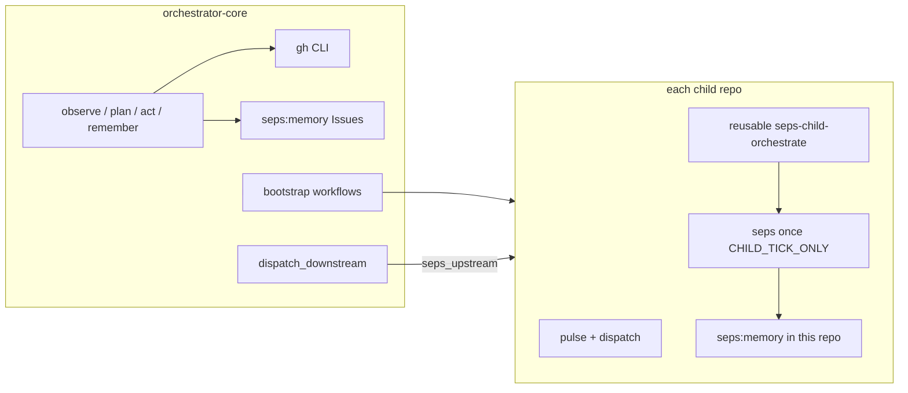

# SEPS — Orchestrator Core

**[seps-sol](https://github.com/seps-sol)** is an **agent-native** swarm: coordination on **GitHub** (Issues + Actions + `gh`), durable **issue-backed memory**, **cross-repo CI chains**, and a path to **Solana** for agent payments (see [PRD](orchestrator/README.md)).

This repository is the **parent orchestrator**: it runs the full **LangGraph** loop, **bootstraps** child repos, and publishes the **org profile** for [`seps-sol/.github`](https://github.com/seps-sol/.github).

---

## What we’re up to (architecture)



**CI automation:** default workflow YAML has **no timers** and **no `repository_dispatch` triggers**—use **Actions → Run workflow** (or `uv run seps once` locally).

| Mode | Where | `seps once` behavior |
|------|--------|----------------------|
| **Parent** | This repo’s CI / your laptop | Full loop: org observation, LLM plan (plus optional **`config/steering.md`** injected into context), **`gh repo create`** for `NEXT_REPO`, optional new **`seps:task`** when the plan ends with `SEPS_OPEN_TASK: yes`, **remember** → `SEPS_MEMORY_REPO` (default **this** repo). |
| **Child** | Reusable [`.github/workflows/seps-child-orchestrate.yml`](.github/workflows/seps-child-orchestrate.yml) | **`SEPS_CHILD_TICK_ONLY`**: same loop but **no org repo creation**; memory + tasks scoped to **that child** via `SEPS_MEMORY_REPO` / `SEPS_TASKS_REPO`; may open **`seps:task`** on **this** repo when the plan opts in. |

**Issue labels:** **`seps:task`** (work board), **`seps:memory`** (tick log).  
**Cross-repo CI (optional when you run workflows):** [`config/ci_triggers.json`](config/ci_triggers.json) + **`repository_dispatch`** event **`seps_upstream`** (used from `dispatch_downstream.sh` when a workflow run executes it).  
**Child workflow file:** pushed from [`src/seps/child_self_run.workflow.yml`](src/seps/child_self_run.workflow.yml) by [`uv run seps bootstrap workflows`](src/seps/bootstrap.py). Template matches parent: **`workflow_dispatch` only**.

---

## Prerequisites

- [GitHub CLI](https://cli.github.com/) (`gh`) — **all** GitHub mutations go through `gh`, not the REST SDK.
- Auth: `gh auth login` **or** `GITHUB_TOKEN` / `GH_TOKEN` in `.env`.

## Quickstart

```bash
cd /path/to/orchestrator-core
cp .env.example .env   # set GITHUB_ORG, OPENAI_API_KEY or ANTHROPIC_API_KEY, optional GITHUB_TOKEN
uv sync
uv run seps once                    # full parent tick
uv run seps once --dry-run          # no repo create / no memory write
uv run seps tasks list              # open seps:task issues
uv run seps memory list             # recent seps:memory issues
uv run seps bootstrap workflows     # sync child workflows + baked triggers
uv run seps execute --repo agent-marketplace --issue 163 --dry-run   # draft PR handoff (no push)
```

Org landing copy (GitHub profile) is edited in [`.github-org-readme/profile/README.md`](.github-org-readme/profile/README.md) and published with:

```bash
./scripts/publish_org_profile.sh
```

---

## GitHub Actions (parent workflow)

[`.github/workflows/orchestrator.yml`](.github/workflows/orchestrator.yml) — **`workflow_dispatch` only** (no `repository_dispatch`). Run **Orchestrator tick** from the Actions tab when you want a cycle.

[`.github/workflows/seps-execute-task.yml`](.github/workflows/seps-execute-task.yml) — **`workflow_dispatch`** to run **`uv run seps execute`** against any child repo (clone → handoff doc under `docs/seps-handoffs/` → **draft PR**). Needs a token that can **push** and open **pull-requests** on the target repo (same as **`SEPS_GITHUB_TOKEN`** on the parent).

Each orchestrator run (simplified): **pull all org repos** → **`seps once`** → **`seps bootstrap workflows`** → **`dispatch_downstream.sh`** (orchestrator’s row in `ci_triggers.json`) → **publish org profile**.

When a planner ends with **`SEPS_OPEN_TASK: yes`** and **`SEPS_EXECUTE: yes`**, the same tick can open the new **`seps:task`** and immediately run **`seps execute`** for that issue (optional **`SEPS_EXECUTE_LLM: yes`** for an outline in the doc).

**Secrets**

| Secret | Where | Why |
|--------|--------|-----|
| **`SEPS_GITHUB_TOKEN`** | **orchestrator-core** | Classic **`repo`** PAT: create org repos, push workflows to children, dispatch, update **`org/.github`**. Default `GITHUB_TOKEN` cannot do this across repos. |
| **`SEPS_CROSS_REPO_TOKEN`** | **each child** (optional) | PAT with **`repo`** so a **manually run** child workflow can **`repository_dispatch`** to downstream repos. Without it, **downstream dispatch is skipped**. |
| **`OPENAI_API_KEY`** / **`ANTHROPIC_API_KEY`** | parent + optionally each child | LLM planning; children only need this if you want LLM in **child** ticks. |

**Optional chaining:** to react to upstream events again, you can add a `repository_dispatch` `on:` block to the workflow YAML (still no timers), then `uv run seps bootstrap workflows`.

---

## Layout

| Path | Role |
|------|------|
| `src/seps/graph.py` | LangGraph: observe → plan → act → remember |
| `src/seps/execute_task.py` | `seps execute`: draft PR + `docs/seps-handoffs/issue-*.md` from a `seps:task` |
| `src/seps/gh_cli.py` / `github_client.py` | `gh` subprocess + org helpers |
| `src/seps/bootstrap.py` | Renders + pushes child `seps-self-run.yml` |
| `src/seps/child_self_run.workflow.yml` | Child template (`workflow_dispatch` only; reusable orchestrate) |
| `.github/workflows/seps-child-orchestrate.yml` | Reusable: checkout this repo, `uv run seps once` with child env |
| `config/steering.md` | Product steering text injected into every LLM plan (edit freely) |
| `config/child_repos.json` | Repo names the parent can plan / bootstrap |
| `config/ci_triggers.json` | Downstream list per repo for `seps_upstream` |
| `scripts/pull_org_repos.sh` | Shallow pull/clone all org repos on the runner |
| `scripts/dispatch_downstream.sh` | Dispatches from `ci_triggers.json` |
| `scripts/publish_org_profile.sh` | Syncs profile to `ORG/.github` |
| `.github-org-readme/profile/README.md` | **Org** README source |
| `orchestrator/README.md` | Full PRD |

---

**Product spec:** [orchestrator/README.md](orchestrator/README.md)
